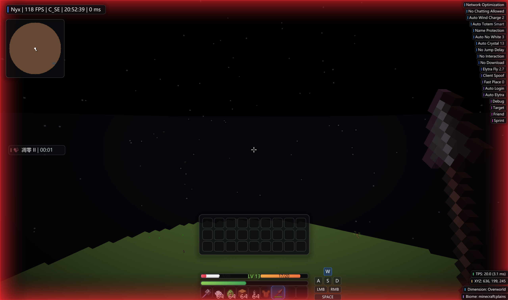

# NyxClient

NyxClient 是一个基于 NeoForge 的 Minecraft 客户端模组，当前面向 Minecraft `1.21.11` 开发。项目包含模块系统、事件总线、Mixin 注入、配置持久化、Click GUI、自定义主菜单、HUD 编辑、字体渲染、音乐播放器、账号管理、多语言资源与一批战斗、移动、玩家、视觉和实用模块。

> 项目仍处于开发阶段。部分功能会改变客户端行为或网络交互，请只在单机、开发测试或明确允许的服务器环境中使用，并遵守目标服务器规则。

## 游戏内截图



## 环境要求

- Java 21
- Minecraft `1.21.11`
- NeoForge `21.11.42` 或兼容的 `21.x` 版本
- Gradle Wrapper，仓库已包含 `gradlew` / `gradlew.bat`
- Node/npm 网络访问能力：构建时会下载并打包网易云音乐本地服务依赖与跨平台 Node 运行时

## 快速开始

克隆仓库后，在项目根目录执行：

```powershell
.\gradlew.bat build
```

构建产物位于：

```text
build/libs/nyxclient-0.0.1.jar
```

开发环境运行客户端：

```powershell
.\gradlew.bat runClient
```

运行开发服务器：

```powershell
.\gradlew.bat runServer
```

生成数据资源：

```powershell
.\gradlew.bat runData
```

如果你在 Linux 或 macOS 下开发，把命令中的 `.\gradlew.bat` 换成 `./gradlew`。

## 安装方式

1. 安装 Minecraft `1.21.11` 与匹配的 NeoForge。
2. 执行 `.\gradlew.bat build`。
3. 将 `build/libs/nyxclient-0.0.1.jar` 放入游戏目录的 `mods` 文件夹。
4. 启动游戏，模组 ID 为 `nyxclient`。

## 使用说明

- 默认按键：`Right Shift` 打开 Click GUI。
- 在 Click GUI 中左键点击模块条目可以启用或关闭模块。
- 鼠标滚轮可以滚动模块列表，模块设置会随配置保存。
- 客户端会替换标题界面和多人游戏界面为 Nyx 自定义主菜单。
- 主菜单右上角设置按钮可以切换背景，背景文件来自 `<游戏目录>/nyxclient/gui/background/`。
- `Music Player` 模块会打开网易云音乐播放器，底部频谱和 HUD 歌词组件可以配合使用。
- `HUD` 模块启用后会显示水印、通知、TPS、坐标、生物群系、小地图、按键显示、歌词等组件；打开聊天界面时可以拖动组件，滚轮可以缩放悬停组件。

## 命令

默认命令前缀是 `.`，可以在 `Client` 模块的 `command prefix` 设置中修改。

```text
.toggle <module>          # 开关模块，例如 .toggle killaura
.bind <module> <key>      # 绑定快捷键，例如 .bind clickgui right_shift
.config list              # 查看配置列表，当前配置会带 *
.config create <name>     # 创建并切换到新配置
.config load <name>       # 切换到已有配置
.friend list              # 查看好友列表
.friend add <name>        # 添加好友
.friend remove <name>     # 移除好友
```

命令中的模块名使用模块类名的小写形式，例如 `clickgui`、`killaura`、`packetmine`、`musicplayer`。

## 配置与数据文件

客户端首次启动后会创建：

```text
<游戏目录>/nyxclient/
<游戏目录>/nyxclient/config/
<游戏目录>/nyxclient/config/profiles/
<游戏目录>/nyxclient/logs/
<游戏目录>/nyxclient/cages/
<游戏目录>/nyxclient/gui/
<游戏目录>/nyxclient/gui/background/
<游戏目录>/nyxclient/friend/
```

主要文件：

```text
<游戏目录>/nyxclient/config/modules.json          # 默认模块配置
<游戏目录>/nyxclient/config/profiles/*.json       # 额外配置档
<游戏目录>/nyxclient/config/selected.txt          # 当前选中的配置档
<游戏目录>/nyxclient/gui/hud.json                 # HUD 组件位置、缩放和主菜单背景选择
<游戏目录>/nyxclient/alts.json                    # 账号管理器数据
<游戏目录>/nyxclient/friend/friends.json          # 好友列表
```

## 当前模块

### Client

- `ClickGui`：打开 Click GUI。
- `Client`：语言、命令前缀、窗口标题等客户端设置。
- `NoChattingAllowed`：账号聊天受限时仍允许打开聊天栏。
- `Debug`：聊天调试信息。
- `Friend`：好友列表模块，供其他模块过滤目标。
- `ClientSpoof`：修改发送给服务器的客户端品牌。
- `Zoom`：按住放大视野。
- `NetworkOptimization`：网络延迟与发包刷新优化。
- `NameProtection`：替换界面中显示的玩家名。
- `EntityCulling` / `BlockCulling`：实体和方块实体剔除优化。
- `ThreadRipper`：将部分客户端 tick 工作拆分到工作线程。

### Combat

- `KillAura`、`Reach`、`UseClick`、`Backtrack`、`TpAura`
- `CrystalAura`、`AnchorAura`
- `MaceKill`、`MaceAura`
- `SpearThrust`、`SpearCooldown`

### Movement

- `Scaffold`、`BHop`、`AutoJump`、`Sprint`、`Stuck`
- `ElytraFly`、`FastFall`、`SafeWalk`、`AntiVoid`、`NoSlow`

### Player

- `AutoHeal`、`FastPlace`、`NoJumpDelay`、`AutoElytra`、`AutoTotem`
- `AutoWindCharge`、`InstantSwitch`、`AutoLeave`、`AutoCrystal`
- `PacketMine`、`PacketEat`、`Blink`、`LagBack`、`AntiEffects`、`NoFall`

### Visual

- `Cape`、`NoRenderer`、`HUD`、`Animations`、`FullBright`、`ModernGui`
- `Chams`、`ContainerESP`、`ESP`、`ViewClip`、`HurtMaker`
- `ModuleList`、`Ambient`、`NameTag`、`Filter`
- `ProjectilePrediction`、`Map`、`KeyStrokes`、`Spectrum`
- `MaceEffect`、`MotionCamera`

### Other

- `Target`：共享目标过滤配置。
- `NoInteraction`：阻止攻击指定实体或好友。
- `PlayerAlert`：玩家进入渲染距离时提醒。
- `AutoLogin`：根据聊天提示自动注册或登录。
- `NoDownload`：跳过服务器资源包下载并回报成功。
- `FakePlayer`：生成本地测试假人。
- `MusicPlayer`：打开网易云音乐播放器。
- `Auto2048`、`AutoNoWhite`：小游戏辅助。
- `Test`：测试模块。

## 构建一个模块

NyxClient 的功能以 `Module` 为单位组织。一个模块通常需要创建模块类、声明模块信息、按需添加设置与事件监听，最后注册到 `ModuleManager`。

### 1. 创建模块类

在合适的分类目录下创建模块，例如 `module/player/ExampleModule.java`：

```java
package io.github.seraphina.nyx.client.module.player;

import io.github.seraphina.nyx.client.module.Category;
import io.github.seraphina.nyx.client.module.Module;
import io.github.seraphina.nyx.client.module.ModuleInfo;

@ModuleInfo(
        name = "nyxclient.module.example.name",
        description = "nyxclient.module.example.description",
        category = Category.PLAYER
)
public class ExampleModule extends Module {
    public static final ExampleModule INSTANCE = new ExampleModule();

    private ExampleModule() {
    }
}
```

`Category` 决定模块在 Click GUI 中出现在哪个分类下，目前可用分类为：

```text
COMBAT, MOVEMENT, PLAYER, CLIENT, OTHER, VISUAL
```

### 2. 添加模块设置

模块设置通过 `ValueBuild` 创建，并会自动加入模块的配置值列表。可用类型包括布尔、整数、小数、枚举、字符串、颜色、按键和按钮。

```java
import io.github.seraphina.nyx.client.value.ValueBuild;
import io.github.seraphina.nyx.client.value.impl.BoolValue;
import io.github.seraphina.nyx.client.value.impl.IntValue;

public class ExampleModule extends Module {
    public static final ExampleModule INSTANCE = new ExampleModule();

    public final BoolValue onlyGround = ValueBuild.boolSetting("onlyGround", true, this);
    public final IntValue delay = ValueBuild.intSetting("delay", 2, 0, 10, 1, this);

    private ExampleModule() {
    }
}
```

这些设置会保存到当前配置档：

```text
<游戏目录>/nyxclient/config/modules.json
<游戏目录>/nyxclient/config/profiles/<name>.json
```

如果一组设置需要在 UI 中分组，可以使用 `ValueBuild.settingGroup(...)` / `ValueBuild.valueGroup(...)` 并向组中加入值。

### 3. 监听事件

需要响应游戏行为时，在模块中添加带 `@EventTarget` 的方法。模块启用时会自动注册到事件系统，关闭时会自动注销。

```java
import io.github.seraphina.nyx.client.events.api.EventTarget;
import io.github.seraphina.nyx.client.events.impl.TickEvent;

@EventTarget
public void onTick(TickEvent.Post event) {
    if (mc.player == null) {
        return;
    }

    if (!onlyGround.getValue() || mc.player.onGround()) {
        // 在这里编写模块逻辑
    }
}
```

如果只需要在开启或关闭时执行一次逻辑，可以重写 `onEnable()` 和 `onDisable()`：

```java
@Override
public void onEnable() {
    super.onEnable();
}

@Override
public void onDisable() {
    super.onDisable();
}
```

### 4. 设置默认按键

模块可以在构造方法中设置默认按键。按键值来自 GLFW：

```java
import static org.lwjgl.glfw.GLFW.GLFW_KEY_G;

private ExampleModule() {
    this.setKey(GLFW_KEY_G);
}
```

未设置按键时，模块默认没有快捷键。

### 5. 注册模块

在 `ModuleManager.init()` 中导入并注册模块实例：

```java
import io.github.seraphina.nyx.client.module.player.ExampleModule;
```

```java
registerModule(
    FastPlace.INSTANCE,
    NoJumpDelay.INSTANCE,
    ExampleModule.INSTANCE
);
```

注册后，模块会出现在 Click GUI 中，并参与配置加载、保存和按键切换。

### 6. 添加语言文本

`@ModuleInfo` 中的 `name` 和 `description` 是语言键，需要在语言文件中添加对应文本。

`src/main/resources/assets/nyxclient/language/en_us.properties`：

```properties
nyxclient.module.example.name=Example
nyxclient.module.example.description=Example module
```

`src/main/resources/assets/nyxclient/language/zh_cn.properties`：

```properties
nyxclient.module.example.name=示例
nyxclient.module.example.description=示例模块
```

## 项目结构

```text
src/main/java/io/github/seraphina/nyx/
├── mod/         # NeoForge 模组入口
└── client/      # NyxClient 主体
    ├── alt/         # 外置账号与 Microsoft 账号数据
    ├── asm/         # 启动期 class processor
    ├── command/     # 客户端命令
    ├── events/      # 事件 API、事件类型与事件总线
    ├── loading/     # NeoForge 早期加载窗口与加载覆盖层
    ├── manager/     # 模块、配置、按键、HUD、好友、字体、路径、旋转等管理器
    ├── mixins/      # Minecraft 客户端注入点
    ├── module/      # 功能模块与分类
    ├── music/       # 网易云音乐 API、本地服务、播放与歌词
    ├── ui/          # 主菜单、Click GUI、账号管理、音乐播放器、HUD 组件等界面
    ├── utility/     # 渲染、玩家、旋转、语言、Web、数学等工具类
    └── value/       # 模块配置值系统

src/main/resources/
├── assets/nyxclient/cape/        # 内置披风资源
├── assets/nyxclient/fonts/       # 内置字体
├── assets/nyxclient/language/    # 多语言文件
├── assets/nyxclient/shader/      # 字体、模糊、Bloom 等 Shader
├── assets/nyxclient/ui/          # 主菜单、图标、音乐播放器资源
├── META-INF/accesstransformer.cfg
└── nyxclient.mixins.json
```

## 常用命令

```powershell
.\gradlew.bat build                    # 构建模组
.\gradlew.bat runClient                # 启动开发客户端
.\gradlew.bat runServer                # 启动开发服务器
.\gradlew.bat runData                  # 运行数据生成
.\gradlew.bat clean                    # 清理构建产物
.\gradlew.bat installNeteaseMusicApi   # 单独安装网易云音乐 API 依赖
.\gradlew.bat downloadBundledNode      # 单独下载内置 Node 运行时
```

## 许可证

本项目使用 GNU GPL 3.0 许可证，详见 [LICENSE](LICENSE)。
